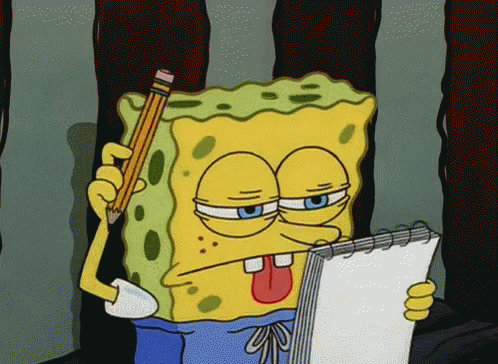

#   ESPAÑOL:
## <i align="center" style="font-size:2rem">✏️ FORMULARIO PARA PRACTICAR REACT HOOK FORM</i>

En este proyecto se usaron hooks como **useState**  , tecnologias como  **HTML,CSS,JavaScript,React,SASS,Bootstrap** y para el manejo de formularios **React Hook Form**

 _Este proyecto fue construido con el proposito de practicar RHF_

**Nota: Es responsivo**

## 💡 Como se penso este proyecto y como funciona

**_Idea Principal: Una formulario para practicar RHK_**

Primero que nada decidí agilizar los estilos del formulario que iba a crear con Bootstrap para asi desarrollarlo de forma rapida, por que queria concentrarme en la logica del formulario. Luego los estilos mas puntuales los estilice con SASS.

Cree un formulario con diferentes Inputs y Labels , cree muchos para asi poder practicar de mejor forma la libreria RHK.

El hook mas importante y el orquestador de la magia es el hook **useForm**.

Registre los diferentes inputs,hice las validaciones correspondientes a cada uno , asigne la funcion al envio del formulario  y en caso de errores se colocarian  los estilos correspondientes y un span donde iria el mensaje del error correspondiente a cada input y su tipo.

Cree un estado para manejar la Modal que se abre cuando el formulario se envia de forma completa y correcta.

----------------------------------------------------------------------------------
----------------------------------------------------------------------------------

#  ENGLISH:

## <i align="center" style="font-size:2rem">📝 FORM TO PRACTISE REACT HOOK FORM </i>
In this project was used hooks like **useState** , technologies like  **HTML,CSS,JavaScript,React,SASS,Bootstrap** and for forms managment **React Hook Form**

 _This project was built to practising RHK_

**Note: It´s responsive**

## 🤔 How this project was thinked and how it works

**_Main Idea: A form to practise RHK_**

First of all I decided to develop the form styles with Bootstrap because ir allows me to develop faster and I wanted to concentrate on the form logic. For the more specific styles I used SASS.

I created the form with so many inputs and labels to better practise the RHK library.

The main hook and orchestrator of the magic is the  **useForm** hook.

I registered the differents inputs , did the validations for each one , assigned the handle submit function  and in case of errors the corresponding styles and an error message will be displayed for each input and its type.

I have created an state for handle the Modal when the form is submitted complete and correct.
